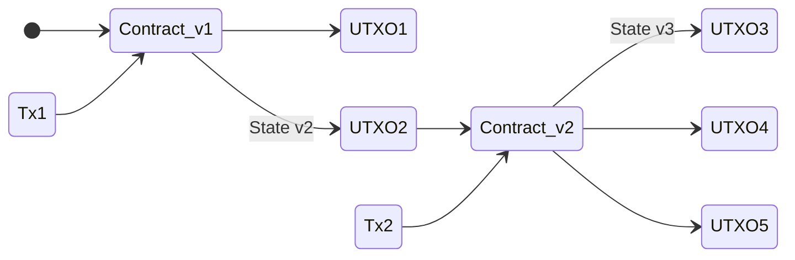

## Abstract

Archethic relies on the UTXO model.
By default this model is stateless, meaning there is not state outside of the transactions.

The advantage of this solution is to propose a better scalability and security regarding the account model in which a state rely outside of the transaction themselves.
The advantage of account model is therefore the usability making smart contract developments trying to mimic the traditional programming paradigms.

Because Archethic leverages also smart-contract capability, being only stateless can make dApps development complex.
Indeed, the transaction allows to have some free content zone to specify any arbitrary data: JSON, Website, etc.
This zone `content` is sometimes used to snapshot the state of transaction chain and therefore help the contract to split its data across several transactions (through the usage of sharding)

However, sometimes we want to use this `content` zone to store other data than just the state.
While this is possible, it makes the developer needs to thing of how to structure this zone to gather chain's state and other data.
This is not convenient.

So I would like to present an approach to still leverage UTXO and have to capability to embed state into them to free the `content` zone by introducing stateful UTXO.

## Specification

Stateful UTXO leverages the same paradigm as the stateless UTXO:
- the source of truth remains on the transaction themselves
- the state is transmitted across shards by simply using UTXO transfers

Other sharding solutions struggle with cross-shard synchronization because there are not based on the UTXO model and requires background synchronization of the state. 
This approach can be prune to multiple issues in term of synchronization and missing state.

With the UTXO approach, no hassel of data transmission and synchronization; as long as the transaction is transmitted, the state will be also.

> Remark: By having the state on-chain within the transaction, introspection of the smart contract chain or dApp will be easier to understand.



### Data structure

To implement this new UTXO model we will need to declare a new field in the UTXO structure to support the state.

```jsonc
{
   "from": "0f1d....",
   "type": "...",
   "amount: "...","
   "state": "03cd..." // Encoded and compressed state transmitted over the chain
}
```

This state will act as key-value storage and will be implemented over a custom serialization protocol to be efficient in terms of storage and network cost.
For example:
```json
{
  "addresses": [
    "0000FE4D03A0254616FB5CDBA8ACC107D88EDA3C53A5E3B4E63517454EC825C252E5",
    "0000D25C944F11D4729CA64AD0D72D1EADE827E88665F22424BFAE3CC2F390D0B5B1",
    "0000A1C527B0F20E37B97D4468277CB1253538D17EBCC2D5C311B5476F99B2DD0951"
  ],
  "counter": 3,
  "status": "Pending"
}
```

This state could be encoded with raw binary following this structure:

| Field | Size |
|-------|------|
| Name size | VarInt
| Name | Dynamic
| ValueType | Byte |
| ValueSize | VarInt |
| Value | Dynamic |

Then once encoded, the state would have to be compressed with algorithm such zlib/gzip.

### Smart Contract's interpreter

Once the stateful UTXO will be injected and accepted by the nodes, the interpreter would have to decode it and load it in the interpreter to be accessible from the memory.
Hence new version of smart contract will start from the transmitted state.

Then, the interpreter should expose functions to retrieve and update state's information.

```elixir
State.get(key) # Returns the entry from the given key or nil
State.get(key, default_value) # Returns the entry from the given key or default value

State.put(key, value) # Register a new value
```

Contract actions blocks may or not return transactions.
In the case whether they are not returning transactions, the state abstraction would be updated in memory to be serialized into the UTXO later.

Example:
```elixir
actions triggered_by: transaction do
   counter = State.get("counter")
   new_counter = counter + 1
   State.put("counter", new_counter)

   if mod(new_counter, 10000) == 0 do
     # Return new transaction
     Contract.set_content "Snapshot of 10K calls"
     # New UTXO with new counter as state will be created
   end
end
```

> Remark: The state of the UTXO from a smart contract can be seen as the proof of execution of the smart contract in addition to the transaction itself.

### Fee

Because the stateful UTXO will allow to set data on-chain a particular fee should be added to the transaction's fee for the storage cost of the UTXO's state.

The fee should have some mechanism to incentize developers to optimize the data stored within the chain. 
The compressed size would be used to determine the price of the state.

### Explorer

Because the explorer allow to see all the information regarding the transaction and the UTXO attached, it should also render the state by decoding its compressed form. 