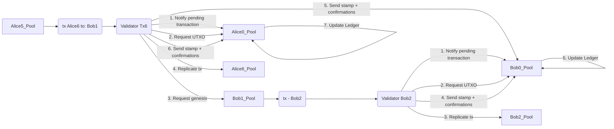

# Abstract

Archethic relies on TransactionChain using multiple independent chains through the UTXO model.

Whereas this works well when some you are evolving your chain and the recipient chains don’t evolve so much, a concurrency issue occurs when both chains evolve quite frequently, for example a smart contract.

Because Archethic’s transaction chain relies on the principle#3/Remark 1 from the YP: 
> The address of any transaction in the same chain could be used as
> a destination address, it is not necessary to specify the last transaction in the chain. 
> 
> (The nodes will automatically replicate the transaction on the storage pool associated with the last
> transaction in the chain).
> 
> -- <cite>YellowPaper (page 9)</cite>

Hence, if the last address of the recipients is also moving , if your are doing a transaction towards its chain, your outputs might be lost resulting in lost funds or lost smart contract calls.

For this reason, we need to find a better way to handle concurrency for independent chains acting as asynchronous streams.

# Specification

## Assomptions

- We would not like to have to lock chains
    - to avoid deadlock
    - to avoid false positive (subject to concurrency issue as well)
- We would not like to disrupt the usage of the chains by retrying until one pass (like Cardano)
- We want to reduce as much as possible the bandwidth cost to replicate transaction

## Proposition

In the YellowPaper, the principle identifies the solution to target the last transaction of the chain, but we can still leverage this remark and introduces a intermediary level of synchronization before in order to notify the last address.

For this, we can use the **genesis pool** as:
- pivot of synchronization
- concurrency signalization

Because the transaction in chain are serialized, we can take this concurrency flaw and turns into order for chain synchronization, using the genesis pool

### Genesis pool

Each chain has a origin or genesis transaction's address which helps to identify the unicity of a chain.

This chain can be notified about new validated transactions and also new incoming transactions.

To support a more efficient storage and bandwidth cost, this genesis would not have to store and forward the incoming transaction.
Instead, genesis pool storage nodes can hold a set of entries to identify the spent or unspent inputs for this chain.

This pool will act as notification center or ordering for new incoming transactions helping validators to get the right inputs ledger.

To do so, the genesis pools will receive validation stamp from the validation nodes and build the input ledger:
- with incoming transaction: it will list the movements towards the chain and extract them as unspent outputs
- with chain's transaction: it will list the spent inputs and update the unspent outputs

The genesis pool should ensure an input cannot be ingested if it's already spent to avoid double spending.

Along with the validation stamp, the genesis pool will get the transaction's summary and replication attestations to ensure the transaction is valid according
to the 1/3 threshold of replica confirmations.

### Validation

During the validation, the nodes will not request anymore the previous storage nodes to get the unspent outputs but will request the genesis pool to get the current unspent inputs.

The validation stamp would need to be adapted to support a more determinist approach where the consumed inputs will be stored.
This will help genesis pools later to identify spent inputs and prevent them to be used for further transactions.

Unspent outputs in the validation stamp will be a consolidated view with the list of unspent inputs + new generated unspent outputs (for example for UCO) at the time of the transaction

> To get the accurate and live balance, we would need to request the genesis pool which hold the entire input ledger.

### Overview
 

