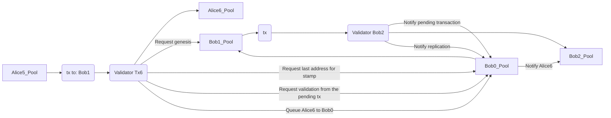

# Abstract

Archethic relies on TransactionChain using multiple independent chains through the UTXO model.

Whereas this works well when some you are evolving your chain and the recipient chains don’t evolve so much, a concurrency issue occurs when both chains evolve quite frequently, for example a smart contract.

Because Archethic’s transaction chain relies on the principle#3/Remark 1 from the YP: 
> The address of any transaction in the same chain could be used as
> a destination address, it is not necessary to specify the last transaction in the chain. 
> 
> (The nodes will automatically replicate the transaction on the storage pool associated with the last
> transaction in the chain).
> 
> -- <cite>YellowPaper (page 9)</cite>

Hence, if the last address of the recipients is also moving , if your are doing a transaction towards its chain, your outputs might be lost resulting in lost funds or lost smart contract calls.

For this reason, we need to find a better way to handle concurrency for independent chains acting as asynchronous streams.

# Specification

## Assomptions

- We would not like to have to lock chains
    - to avoid deadlock
    - to avoid false positive (subject to concurrency issue as well)
- We would not like to disrupt the usage of the chains by retrying until one pass (like Cardano)

## Proposition

In the YellowPaper, the principle identifies the solution to target the last transaction of the chain, but we can still leverage this remark and introduces a intermediary level of synchronization before in order to notify the last address.

For this, we can use the **genesis pool** as:
- pivot of synchronization
- concurrency signalization
- incoming queue

Because the transaction in chain are serialized, we can take this concurrency flaw and turns into something great to bring order in chain synchronization.

Indeed the genesis pool would hold one pending transaction at a time, helping others chains to synchronize with it.

The genesis pool will act as notification center and router/ordering for new incoming transactions.

This would also help validators to identify whether the incoming transaction is still valid according to the pending transaction on the recipient chain.

Also, they will be able to identify the last transaction's address resolved to be included in the validation stamp.

Finally, the pool can hold the incoming transactions to be dequeued once the transaction is validated.

