# Abstract

**AEIP-23** Enhances **AEIP-4** by defining a securisation protocol.

This AEIP attempts to solve Man in the middle attacks and related issues :
- leak of private data embedded in RPC calls
- malicious modification of RPC calls content

## Example :
**DApp** wishes to send **10UCO** to the **wallet** (adress **A**). 

A malicious app attempts a **Man In The Middle** attack to modify the recipient wallet address.

The end user receives the confirmation request on **AEWallet**. If **user** is not focused, he could miss the **recipient address** fraud.
---

# Solution : ECDH + Challenge

```mermaid
sequenceDiagram 
    actor user as User
    participant dapp as DApp
    participant wallet as AEWallet

    user ->> dapp: initiates operation

    opt If no DApp session established 
        rect rgba(125, 125, 125, 25)
            Note over dapp,wallet: ECDH handshake
            dapp --> dapp: 🔑 generates session key pair :<br>(DAppPubKey, DAppPrivKey)
            dapp ->> wallet: create session (DAppPubKey)
            wallet --> wallet: 🔑 generates session key pair :<br>(WalletPubKey, WalletPrivKey)
            wallet --> wallet: 🔐 Generates shared AES Key<br>(WalletPrivKey, DAppPubKey)
            wallet ->> dapp: WalletPubKey
            dapp --> dapp: 🔐 Generates shared AES Key <br>(DAppPrivKey, WalletPubKey)
        end

        rect rgba(125, 125, 125, 25)
            Note over user,wallet: DApp impersonation challenge
            dapp --> dapp: generates challenge 
            dapp ->> wallet: AES(challenge)
            dapp ->> user: display challenge
            wallet --> wallet: decrypt(AES(challenge))
            wallet ->> user: Is challenge same as the one displayed on DApp ?

            alt Challenge validated by user
                wallet ->> dapp: Session established 👍<br>
            else Challenge rejected by user
                wallet ->> dapp: Session rejected ❌
            end
        end
    end

    rect rgba(125, 125, 125, 25)
        Note over user,wallet: Secured operation
        dapp ->> wallet: {sessionId: DAppPubKey, payload: AES(RPC operation)}
        wallet --> wallet: Checks session validity<br>Gets session related AES key
        alt Session is valid
            wallet --> wallet: performs operation
            wallet ->> dapp: operation result
        else Session is not valid
            wallet ->> dapp: operation rejected ❌
        end
    end

    dapp ->> user: operation result
```

