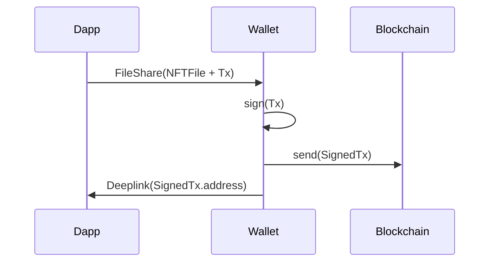

# Abstract

**AEIP-4** purpose is to define a **communication protocol** between decentralized applications and Archethic Wallet.

> Communication protocols depend on the host operating system. Proposals are listed here.


----

# Transport layer

## Desktop - Heavy & Web client : Local RPC server

| Platform | Support |
|----------|:--:|
| Mobile (Web/App)              | ❌ |
| MacOS/Windows/Linux (Web/App) | ✅ |

### Overview

- **Wallet app** provides a Websocket server using the **[JSON-RPC 2.0](https://www.jsonrpc.org/specification)**. 
  - Runs as the native desktop application.
  - Provides a *notification zone* icon. Can be automatically run on computer startup.
- **Browser extension** injects a client in web pages (like [EIP-1193](https://eips.ethereum.org/EIPS/eip-1193 does).
  - **Extension** proxies RPC to **Wallet app RPC server**.
  - Can check **Wallet app**'s RPC server readyness.

 ⚠️ ***Browser extension*** is NOT an **Archethic wallet** wrapped as a navigator extension. It is a distinct code base dedicated to **RPC bridge** problematics.


### Request formatting
Requests are encapsulated in a **[JSON-RPC 2.0](https://www.jsonrpc.org/specification)** message.

```typescript
{
  "id": Number,     // a unique client-generated integer identifying the request
  "jsonrpc": "2.0",
  "method": String, // a string containing the method to be invoked
  "params": {
    "origin": {
      "name": Number,             // human readable identifier of the DApp
      "url": String | undefined,   // URL of the DApp
      "logo": Base64 | undefined, // logo of the DApp 
    },
    "version": 2,         // Version of the DApp API
    "payload": Object | undefined,  // Method parameters
  }
}
```

### Success Response formatting

Success response : 

```typescript
{
  "id": Number,       // the request identifier
  "jsonrpc": "2.0",
  "result":  Object,  // result payload
}
```

### Failure Response formatting

```typescript
{
  "id": Number,       // the request identifier
  "jsonrpc": "2.0",
  "error": {
    "code": Number,   // Error code
    "message": String | undefined, // Error description
    "data": Object | undefined,    // Error data
  },
}
```


## Mobile : DeepLink

| Platform | Support |
|----------|:--:|
| Mobile (Web/App) | ✅ |
| MacOS (Web/App) | ✅ |
| Windows/Linux | ❌ |


### Overview

**WalletApp** handles DApp requests through an Https Deeplink endpoint.

**DApp** implements a callback deeplink to receive requests responses.


### Deeplink codec

Deeplink **messages** are appended to the deeplink URI. Because of that, there are limitations in the available formatting.

To get it working, the **message** is encoded that way :


```
                     +--------------+   +------+   +--------+
method_payload :     | Json Message |-> | gzip |-> | base64 |
                     +--------------+   +------+   +--------+


Deeplink Url : `aewallet://archethic.net/<method_name>/<method_payload>`
```


**Example :**

```
                     +--------------------------+      +----------------------------------------------------------------+
method_payload :     | { "param1" : "a_value" } |----> | "H4sIAAAAAAAAA6tWUCpILErMNVRSsFJQSowvS8wpTVVSqAUAhIgKchgAAAA=" |
                     +--------------------------+      +----------------------------------------------------------------+


Deeplink Url : `aewallet://archethic.net/a_method/H4sIAAAAAAAAA6tWUCpILErMNVRSsFJQSowvS8wpTVVSqAUAhIgKchgAAAA=`

```


### Request formatting

Requests payload are encapsulated in a **[JSON-RPC 2.0](https://www.jsonrpc.org/specification)** message.

```typescript
{
  "id": Number,       // a unique client-generated integer identifying the request
  "replyUrl": String, // Deeplink URL to which send the invokation result. This should be a Deeplink URL handled by the DApp.
  "params": {
    "origin": {
      "name": Number,             // human readable identifier of the DApp
      "url": String | undefined,   // URL of the DApp
      "logo": Base64 | undefined,  // logo of the DApp 
    },
    "version": 2,         // Version of the DApp API
    "payload": Object,  // Method parameters
  }
}
```

### Success Response formatting

```typescript
{
  "id": Number,       // the request identifier
  "result":  Object,  // result payload
}
```

### Failure Response formatting

```typescript
{
  "id": Number,       // the request identifier
  "failure": {
    "code": Number,   // Error code
    "message": String | undefined, // Error description
    "data": Object | undefined,    // Error data
  },
}
```


### Limitations : Howto send heavy payloads (NFT creation) ?



This is a two steps operation :
1. Share file to WalletApp using FileShare
2. Once file is copied in the WalletApp documents directory, WalletApp triggers TxSignature Deeplink

FileShare : Requires a platform-specific implementation
- Web : https://developer.chrome.com/articles/web-share-target/ https://web.dev/patterns/files/receive-shared-files/ 
- Android/iOS : https://pub.dev/packages/receive_sharing_intent 


# RPC Methods (draft)

There are two kinds of methods : 
 - one time call 
 - subscriptions.

Subscriptions won't be available on Deeplink channel because of technical limitations.

## connect

Asks the right to ???? 

### Request

```typescript
{
  "TTL": Number,  // Duration of the permission, expressed in seconds.
}
```

### Success Response

```typescript
// no payload in response success
```


## getEndpoint

Gets the endpoint URL used on AEWallet.


### Request
```typescript
// no payload in request
```

### Success Response
```typescript
{
  "endpointUrl": String // Endpoint URL
}
```

## getServices

Gets the services setup on AEWallet.

### Request
```typescript
// No payload
```

### Success Response
```typescript
{
  "services": [
    {
      "name": String,           // Service name
      "genesisAddress": String, // Transaction chain genesis address  
    }
  ]
}
```

## sendSingleTx

Signs and sends a transaction.

### Request
```typescript
{
  "service": String | undefined,   // The emitting service name. I undefined, AEWallet will ask the user which account to use
  "suffix": String | undefined,    // Derivation path suffix.
  "transaction": Object,          // The transaction to send
}
```

### Success Response
```typescript
{
  "transactionAddress": String,  // Sent transaction address.
  "nbConfirmations": Number,     // Number of received confirmations.
  "maxConfirmations": Number,    // Max number of confirmations. 
}
```

## sendMultipleTx

Signs and sends a transaction.

### Request
```typescript
{
  "transactions": [
    {
      "service": String | undefined,   // The emitting service name. I undefined, AEWallet will ask the user which account to use
      "suffix": String | undefined,    // Derivation path suffix.
      "transaction": Object,          // The transaction to send
    }
  ]
}
```

### Success Response
```typescript
{
  "transactions": [
    {
      "transactionAddress": String,  // Sent transaction address.
      "nbConfirmations": Number,     // Number of received confirmations.
      "maxConfirmations": Number,    // Max number of confirmations. 
    }
  ]
}
```

## signPayload

Signs data with a service private key.
If derivation path suffix is set, the private key is derived from [service private key], and [service derivation path + suffix].

### Request
```typescript
{
  "service": String | undefined,   // The emitting service name. I undefined, AEWallet will ask the user which account to use
  "suffix": String | undefined,    // Derivation path suffix.
  "payload": Object,              // The payload to sign
}
```

### Success Response
```typescript
{
  "signedPayload": String,  // Signed payload
}
```

## decryptPayload

Decrypts data with a service private key.
If derivation path suffix is set, the private key is derived from [service private key], and [service derivation path + suffix].

### Request
```typescript
{
  "service": String,              // The service name.
  "suffix": String | undefined,    // Derivation path suffix.
  "encryptedPayload": Object,              // The encrypted payload
}
```

### Success Response
```typescript
{
  "clearPayload": String,  // Decrypted payload
}
```


## accountSubscribe
Subscribes to account changes.

### Request
```typescript
{
  "service": String // service name
}
```

### Success Response
```typescript
{
  "subscriptionId": Number  // Subscription id (required to unsubscribe)
}
```

### Notification format

Method name : `accountNotification`.
```typescript
{
  "subscriptionId": Number,  // Subscription id
  "account": {           // Undefined if account is removed
    "name": String,         // account name
    "balance": Number,      // balance
    "lastAddress": String,  // last transaction address
  } 
}
```
## accountUnsubscribe
Unsubscribes to account changes.

### Request
```typescript
{
  "subscriptionId": String // Subscription id.
}
```

### Success Response
```typescript
// empty
```
