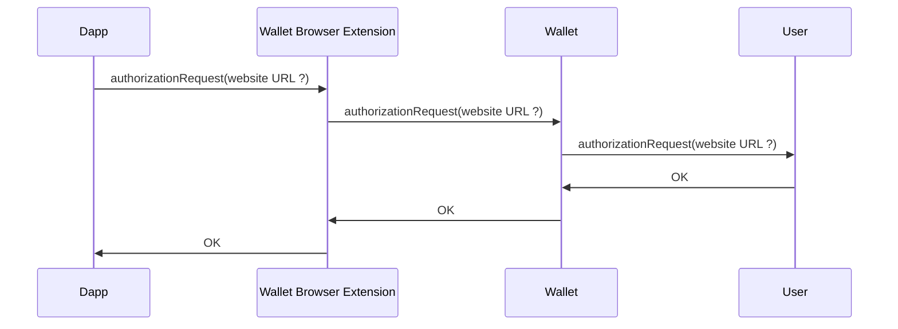
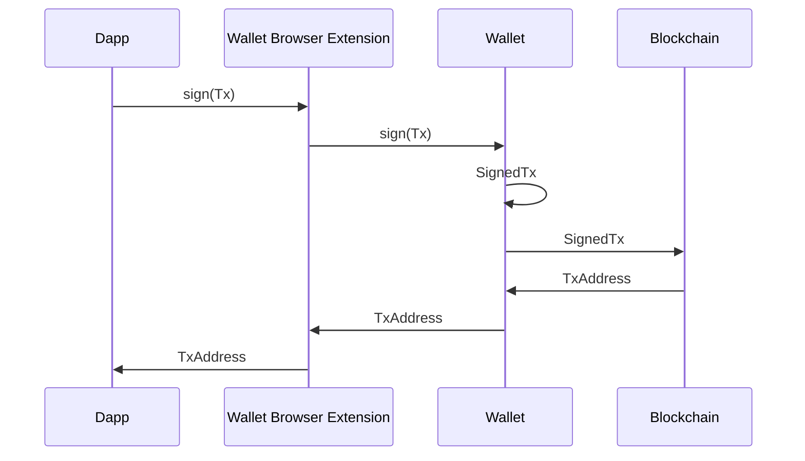
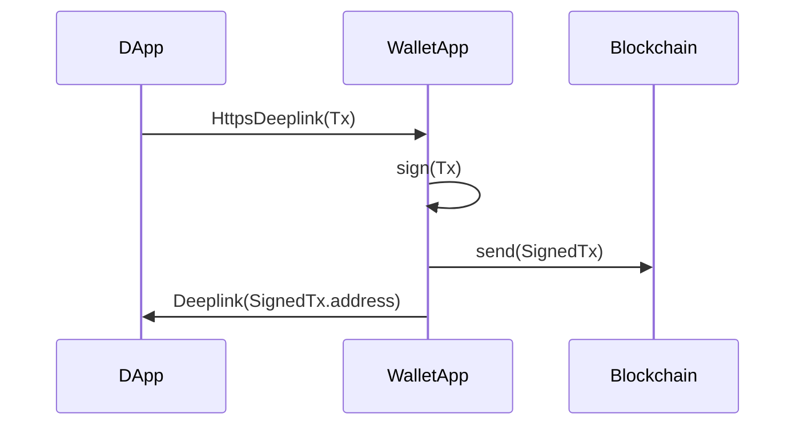
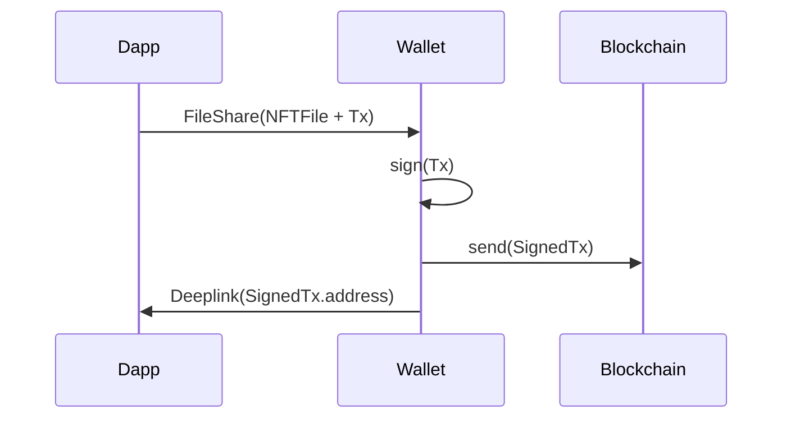
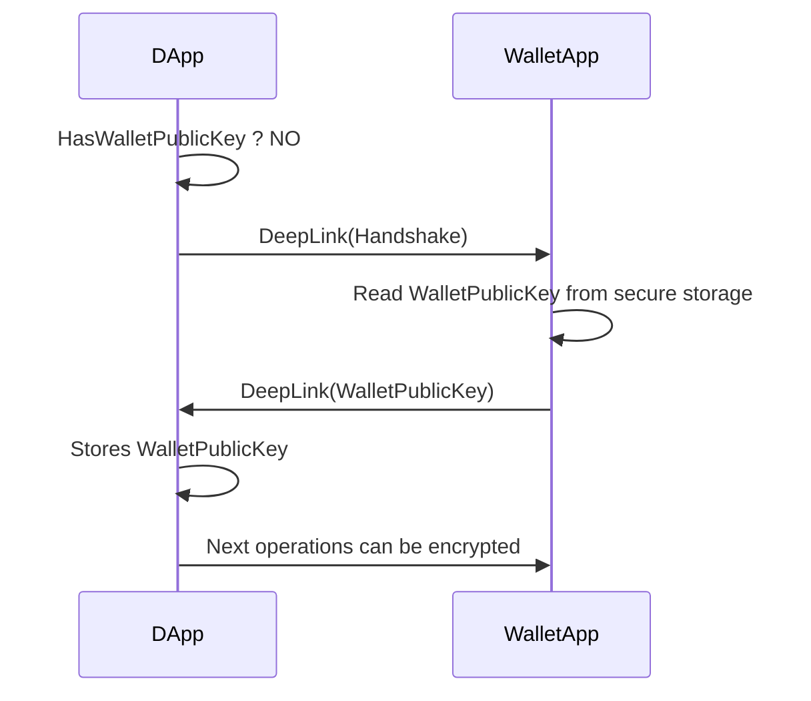

# Abstract

**AEIP-4** purpose is to define a **communication protocol** between decentralized apps and Archethic Wallet.

> ⚠️ This is a Draft.
>
> Communication protocols proposals are listed here.

# Specification 1: Local RPC server

| Platform | Support |
|----------|:--:|
| Mobile (Web/App)              | ❌ |
| MacOS/Windows/Linux (Web/App) | ✅ |

## Overview

- **Wallet app** providing an **RPC server**
- **Browser extension** implementing [EIP-1193](https://eips.ethereum.org/EIPS/eip-1193). **Extension** delegates proxies RPC to **Wallet app RPC server**

## Protocol (WebDapp <-> Wallet)

### First connection

`
### RPC

# Specification 2: Wallet embedded Webview

| Platform | Support |
|----------|:--:|
| Mobile (Web/App)              | ✅ |
| MacOS/Windows/Linux (Web/App) | ✅ |

## Overview

**Wallet application** holds a "webview screen". Webview injects an [EIP-1193](https://eips.ethereum.org/EIPS/eip-1193) implementations.

That way, any visited website can interact with the user's wallet.

# Specification 3: DeepLink

| Platform | Support |
|----------|:--:|
| Mobile (Web/App) | ✅ |
| MacOS (Web/App) | ✅ |
| Windows/Linux | ❌ |

## Overview

**WalletApp** handles DApp requests through an Https Deeplink endpoint.

**DApp** implements a callback deeplink to receive requests responses.

## Protocol (DApp <-> WalletApp)

## Limitations

Howto send a file to create a NTF ?

This is a two steps operation :
1. Share file to WalletApp using FileShare
2. Once file is copied in the WalletApp documents directory, WalletApp triggers TxSignature Deeplink

FileShare : Requires a platform-specific implementation
- Web : https://developer.chrome.com/articles/web-share-target/ https://web.dev/patterns/files/receive-shared-files/ 
- Android/iOS : https://pub.dev/packages/receive_sharing_intent 

## Security

Encryption of data transfered between DApp and WalletApp.

1. WalletApp generates private and public keys (stored in secure storage)
2. DApp requests WalletApp public key (via Deeplink)
3. WalletApp sends public key back using DApp Deeplink callback
4. Next DApp->WalletApp communication's payloads are encrypted using WalletApp public key
