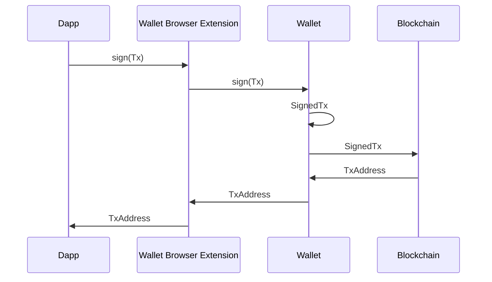
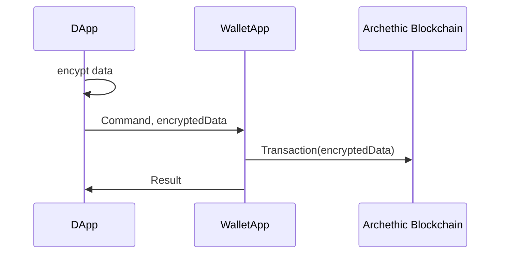
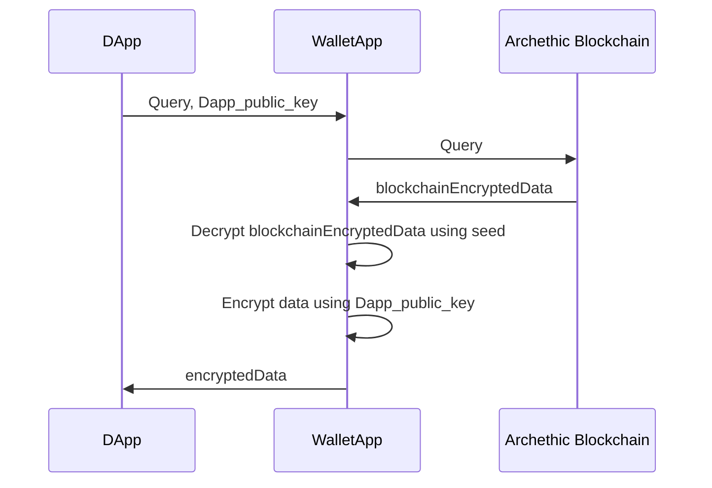
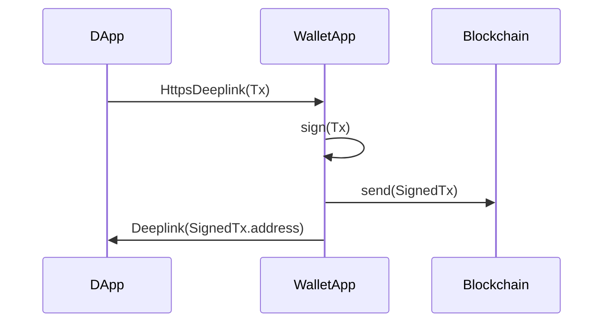
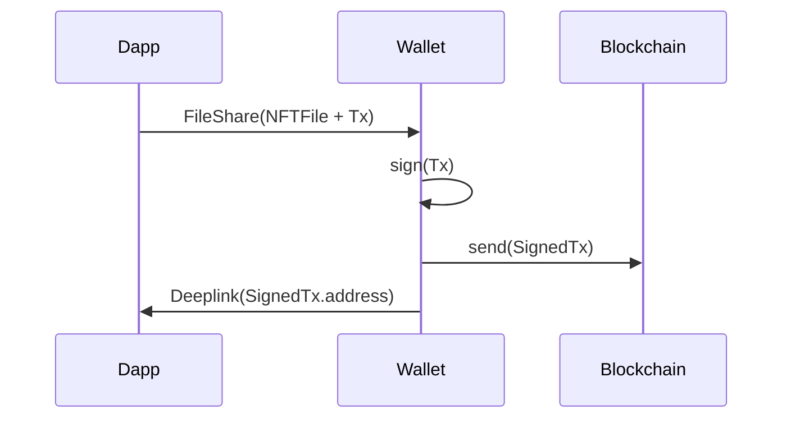
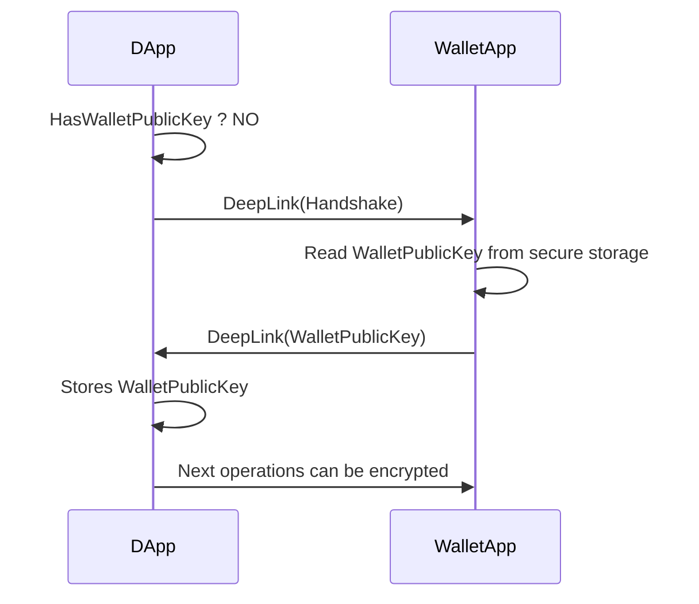

# Abstract

**AEIP-4** purpose is to define a **communication protocol** between decentralized applications and Archethic Wallet.

> Communication protocols depend on the host operating system. Proposals are listed here.

# Functionnalities to expose to DApps

## Sign and send Transaction

- **Input :** Transaction
- **Operation :** Sign and send Transaction. Wait for nodes validation
- **Output :** Validation result + Transaction address

## GraphQL Queries
- **Input :** GraphQL query (String)
- **Output :** GraphQL response (String)

## GraphQL subscription (Desktop only)
- **Input :** GraphQL query (String)
- **Output :** GraphQL response (String)

# Desktop - Heavy & Web client : Local RPC server

| Platform | Support |
|----------|:--:|
| Mobile (Web/App)              | ❌ |
| MacOS/Windows/Linux (Web/App) | ✅ |

## Overview

- **Wallet app** provides an **RPC server**. 
  - Runs as the native desktop application.
  - Provides a *notification zone* icon. Can be automatically run on computer startup.
- **Browser extension** injects a client in web pages (like [EIP-1193](https://eips.ethereum.org/EIPS/eip-1193 does).
  - **Extension** proxies RPC to **Wallet app RPC server**.
  - Can check **Wallet app**'s RPC server readyness.

 ⚠️ ***Browser extension*** is NOT an **Archethic wallet** wrapped as a navigator extension. It is a distinct code base dedicated to that **RPC bridge** problematics.

## Protocol (WebDapp <-> Wallet)
### RPC

## Security

There are two kinds of RPC :

  - Write **Remote Procedure Calls** (Commands). Those are used by DApps to publish content to the blockchain.
  - Read **RPC** (Queries). Used by DApps to read blockchain content.

### Commands :
Commands payload might contain private data. In that case, **private data** will be encypted by **DApp** before sending it to **Wallet**.

### Queries :

Some queries might return user **private data**. In that case, **Wallet** will encrypt data with **DApp** public key before sending it.

# Mobile : DeepLink

| Platform | Support |
|----------|:--:|
| Mobile (Web/App) | ✅ |
| MacOS (Web/App) | ✅ |
| Windows/Linux | ❌ |

## Overview

**WalletApp** handles DApp requests through an Https Deeplink endpoint.

**DApp** implements a callback deeplink to receive requests responses.

## Protocol (DApp <-> WalletApp)

## Limitations : Howto send heavy payloads (NFT creation) ?

This is a two steps operation :
1. Share file to WalletApp using FileShare
2. Once file is copied in the WalletApp documents directory, WalletApp triggers TxSignature Deeplink

FileShare : Requires a platform-specific implementation
- Web : https://developer.chrome.com/articles/web-share-target/ https://web.dev/patterns/files/receive-shared-files/ 
- Android/iOS : https://pub.dev/packages/receive_sharing_intent 

## Security

Encryption of data transfered between DApp and WalletApp.

1. WalletApp generates symmetric keys (stored in secure storage)
2. DApp requests WalletApp public key (via Deeplink)
3. WalletApp sends public key back using DApp Deeplink callback
4. Next DApp->WalletApp communication's payloads are encrypted using WalletApp public key

# [deprecated solution] Wallet embedded Webview

| Platform | Support |
|----------|:--:|
| Mobile (Web/App)              | ✅ |
| MacOS/Windows/Linux (Web/App) | ✅ |

## Overview

**Wallet application** holds a "webview screen". Webview injects an [EIP-1193](https://eips.ethereum.org/EIPS/eip-1193) implementations.

That way, any visited website can interact with the user's wallet.

# [deprecated solution] Wallet wrapped as a navigator extension

| Platform | Support |
|----------|:--:|
| Mobile (Web/App)              | ❌ |
| MacOS/Windows/Linux (Web/App) | ✅ |

## Overview

**Wallet application** is built in a navigator extension (like **Metamask** does).

## Drawbacks

- Used libraries are not always *web compatible*. (e.g. issues with pointycastle)
- Interaction with hardware (Yubikey, Ledger) is tricky
