# Archethic - sécurisation des communications DApp

## Problématique 1 : Ne pas retaper le mot de passe a chaque Tx

### Exemple : 
AEWeb souhaite signer 15 transactions. Actuellement, cela demandera 15 confirmations à l’utilisateur. Pour chacune de ces confirmations, l’utilisateur devra :
- Déverouiller AEWallet (code PIN, biométrie …)
- Valider la transaction 

### Solution :
Ajouter une checkbox sur le clavier de code PIN pour deverouiller pour un certain temps.

## Problématique 2 : Empêcher la modification des requêtes DApp par des attaques Man In The Middle

### Exemple :

**DApp1** souhaite envoyer **10UCO** au **wallet** d’adresse **A**. 

Une application **Mitm** effectue une attque Man in the middle pour modifier l'adresse destinataire.

L'utilisateur reçoit la demande de confirmation sur **AEWallet**. S'il est distrait, il ne verra pas que le destinataire n'est pas le bon.

### Solution : ECDH + Challenge

```mermaid
sequenceDiagram 
    actor user as User
    participant dapp as DApp
    participant wallet as AEWallet

    user ->> dapp: initiates operation

    rect rgba(125, 125, 125, 25)
    Note over dapp,wallet: ECDH handshake
    dapp --> dapp: 🔑 generates session key pair :<br>(DAppPubKey, DAppPrivKey)
    dapp ->> wallet: create session (DAppPubKey)
    wallet --> wallet: 🔑 generates session key pair :<br>(WalletPubKey, WalletPrivKey)
    wallet --> wallet: 🔐 Generates shared AES Key<br>(WalletPrivKey, DAppPubKey)
    wallet ->> dapp: WalletPubKey
    dapp --> dapp: 🔐 Generates shared AES Key <br>(DAppPrivKey, WalletPubKey)
    end

    rect rgba(125, 125, 125, 25)
    Note over user,wallet: DApp impersonation challenge
    dapp --> dapp: generates challenge 
    dapp ->> wallet: AES(challenge)
    dapp ->> user: display challenge
    wallet --> wallet: decrypt(AES(challenge))
    wallet ->> user: Is challenge same as the one displayed on DApp ?

    alt Challenge validated by user
        wallet ->> dapp: Session established 👍<br>(SessionId)
    else Challenge rejected by user
        wallet ->> dapp: Session rejected ❌
    end
    end

    rect rgba(125, 125, 125, 25)
    Note over user,wallet: Secured operation
    dapp --> wallet: {sessionId: SessionId, payload: AES(RPC operation)}
    wallet --> wallet: Checks session validity<br>Gets session related AES key
    alt Session is valid
    wallet --> wallet: performs operation
    wallet ->> dapp: operation result
    else Session is not valid
    wallet ->> dapp: operation rejected ❌
    end
    end

```

## Problématique 3 : Stocker les données de manière sécurisée sur le web

### Exemple : 
À ce jour, **AEWallet** sur le web stocke les données sensibles dans le [localstorage](https://developer.mozilla.org/en-US/docs/Web/API/Window/localStorage).
Ce stockage en soi n'est pas chiffré, et une application tierce malveillante pourrait le lire.

Ce vecteur d'attaque est compliqué à metter en oeuvre, cependant, voici quelque pistes pour le limiter.

### Solution 1 : demander à l'utilisateur un mot de passe supplémentaire

Lors de l'accés au stockage sécurisé, demander à l'utilisateur un mot de passe. Ce mot de passe permettrait de chiffrer les données du stockage.

Les inconvénients de cette solution : 
- Elle est pénible à mettre en oeuvre, alors qu'elle ne sert qu'au Wallet sur le web
- Elle est contraignante d'un point de vue UX (saisie de mot de passe supplémentaire)

### Solution 2 : Avertir l'utilisateur et inciter à utiliser une Yubikey

Lorsqu'on est sur le web, et que le moyen de déverrouiller le wallet est un code PIN, prévenir l'utilisateur du problème de sécurité, et l'inciter à utiliser une Yubikey.